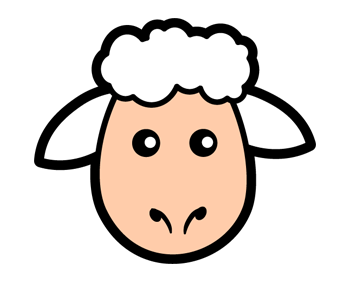
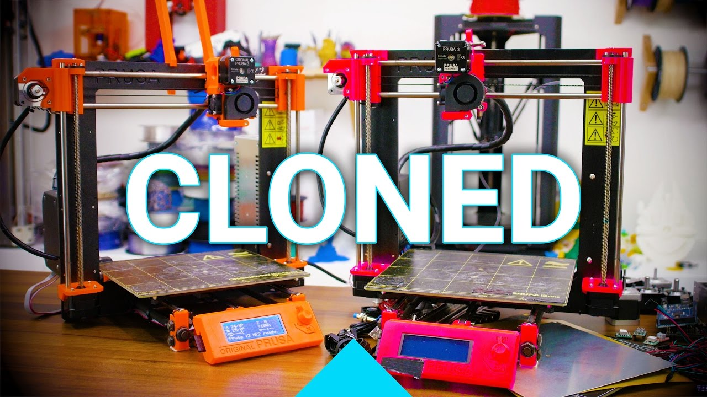

# Prusa i3 MK2S-Dolly

## Introduction

This is a fork of the Original Prusa i3 MK2S found [here](https://github.com/prusa3d/Original-Prusa-i3/tree/MK2S). It reworks the design slightly to make it compatible with more commonly available parts. It builds on changes that were made by [Thomas Sanladerer](https://www.youtube.com/channel/UCb8Rde3uRL1ohROUVg46h1A) for his great video series on building a Prusa i3 MK2 clone, named, [Dolly](https://en.wikipedia.org/wiki/Dolly_%28sheep%29). You can find the BOM and other details of Tom's project on his [site](toms3d.org/dolly/).

Tom's project was based on the Original Prusa i3 MK2. The MK2S was released during filming but after he had already printed the parts. Here we use the MK2S as the base and iterate on that by back-porting Tom's changes from his STL files to the OpenSCAD source material to allow future editing and adding a few further changes for things that he discovered during the assembly process as well as some additional ideas for improvements.

Big thanks to Thomas Sanladerer for a great video series and for creating the original compatible parts! Support him on [Patreon](https://www.patreon.com/toms3dp), watching his videos or using the affiliate links in his BOM.

## Modified Parts

The extruder was not modified for the original video series, however during assembly a few issues cropped up that required some _innovative_ solutions on Tom's part, or as we say, a little MacGyvering. These parts are designed to eliminate the need for that.

Additionally the parts here have been re-created in OpenSCAD to facilitate further editing if required since editing the STL content can be quite limiting. The changed STL files are listed below, however you can find the OpenSCAD data elsewhere in the repository if you want to edit.

### Extruder

The extruder has been changed to shift the filament path 1mm to the right (when viewed from the front of the printer). This is required since the MK8 hobbed gear that is commonly available is slightly larger than the one Prusa supply with the official printer. While you can force your filament in, the path has a lot more resistance and may even break brittle filament such as PLA. This changed required the cover, idler and body to be modified.

Additionally, the 5V inductive probe used for the project is taller than the P.I.N.D.A. probe used by Prusa. This means the cable must run behind the probe itself and not above it as with the original one. It can be wedged in but it will tilt the probe as can be seen in the videos. The changes to the extruder body move the probe mount hole 2.65mm out to the right to make room for the cable. It has also been reworked to shrink the hole (the original MK2S one needs to be insanely tight to get any grip), shorten the mount and reduce it to a single clamp screw. The shortened mount has hold outs for the washers and room to use the top and bottom nut and washer sets provided with the probe to secure it.

* [extruder-body.stl](Printed-Parts/stl/extruder-body.stl)
* [extruder-cover.stl](Printed-Parts/stl/extruder-cover.stl)
* [extruder-idler.stl](Printed-Parts/stl/extruder-idler.stl)

### Y-Corners

The original design Tom used modified the Y-corners with an open hole to allow the more commonly available 350mm smooth rods to pass through. When assembling the printer however this makes squaring difficult as there is no reference length. Additionally even with the cable ties in place the rods can then slide out during Y-axis movement causing the bed to fall. The modified rear Y-corners address this by providing an overhanging cap for the extra 20mm of rod length. If you are lucky enough to have 330mm rods you can just print 4 of the y-corner-front.stl parts instead.

* [y-corners-rear.stl](Printed-Parts/stl/y-corners-rear.stl)

### Y-Motor

_NOTE: Not yet committed._

This part worked fine so this was just a straight backport from the original STL version to OpenSCAD. The resulting mesh is a little cleaner as it hasn't been reprocessed.

* [y-motor.stl](Printed-Parts/stl/y-motor.stl)

### X-Motor

This part worked fine so this was just a straight backport from the original STL version to OpenSCAD. The resulting mesh is a little cleaner as it hasn't been reprocessed.

* [x-end-motor.stl](Printed-Parts/stl/x-end-motor.stl)

## Original Prusa i3 MK2S (original README.md contents)

Original Prusa i3 MK2S is a 3D printer project maintained by PRUSA RESEARCH.
Originates in RepRap project.

This repository contains SCAD files and STLs of the printed parts.

**Links**

 * Prusa Research website : http://prusa3d.com
 * Product page : http://shop.prusa3d.com/en/3d-printers/59-original-prusa-i3-mk2-kit.html
 * Build manual : http://manual.prusa3d.com/c/Original_Prusa_i3_MK2S_kit_assembly
 * Firmware : https://github.com/prusa3d/Prusa-Firmware
